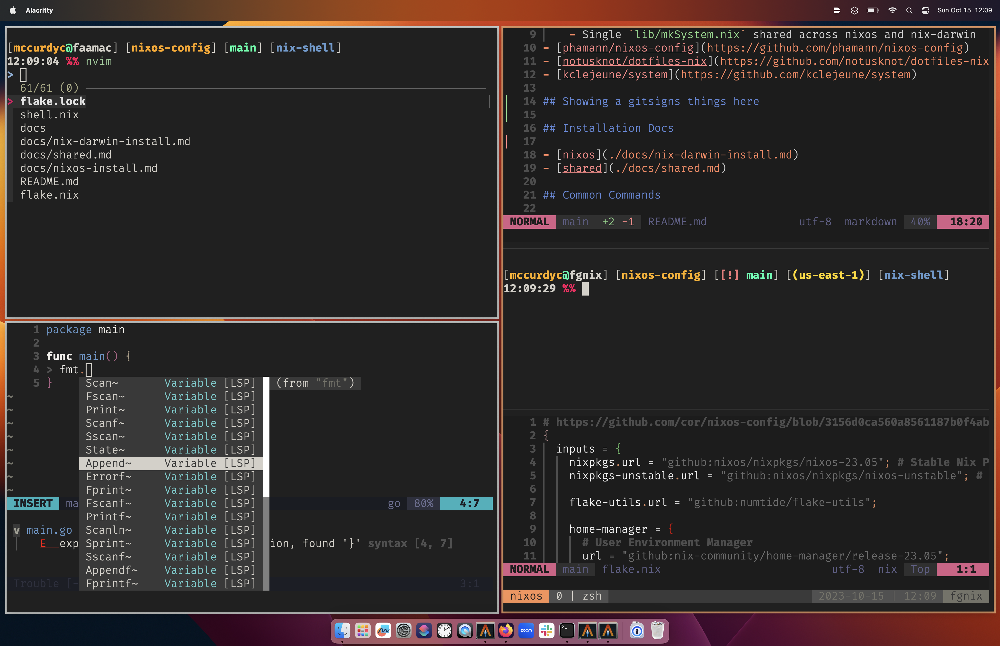

# mccurdyc nixos-config



## Inspiration

- [MatthiasBenaets/nixos-config](https://github.com/MatthiasBenaets/nixos-config/tree/76eea152f56e1a8f4c908b65028e8aa2f7bafaaa)
    - [For Mac](https://github.com/MatthiasBenaets/nixos-config/blob/76eea152f56e1a8f4c908b65028e8aa2f7bafaaa/README.org#nix-darwin-installation-guide)
- [cors/nixos-config](https://github.com/cor/nixos-config/blob/3156d0ca560a8561187b0f4ab3cb25bbbb4ddc9f/flake.nix#L62)
    - Shared modules
- [ryan4yin/nix-config](https://github.com/ryan4yin/nix-config/tree/main)
    - Shared / re-usable modules for testing
    - https://nixos-and-flakes.thiscute.world/nixos-with-flakes/modularize-the-configuration
- [mitchellh/nixos-config](https://github.com/mitchellh/nixos-config)
    - Single `lib/mkSystem.nix` shared across nixos and nix-darwin
- [phamann/nixos-config](https://github.com/phamann/nixos-config)
- [notusknot/dotfiles-nix](https://github.com/notusknot/dotfiles-nix)
- [kclejeune/system](https://github.com/kclejeune/system)
- [tfc/nixos-config](https://github.com/tfc/nixos-configs/tree/main)
    - [Nixcademy Nix Training](https://nixcademy.com/)

## References

### NixOS

- https://nixos.org/manual/nixos/stable/
- https://search.nixos.org/options
    - Searching configuration options
- https://nixos.org/manual/nixos/stable/options
    - Configuration options

### Nixpkgs

- https://nixos.org/manual/nixpkgs/stable/
- https://search.nixos.org/packages

### Nix-Darwin

- https://daiderd.com/nix-darwin/manual/index.html
    - Configuration options

### Home-manager

- https://nix-community.github.io/home-manager/
    - Different section for standalone, nix-darwin and nixos.
    - Different section for ^^, but with flakes!
- https://nix-community.github.io/home-manager/options.html
    - Configuration options

###  Nix

- https://nixos.org/manual/nix/stable/

### Other

- https://nix.dev/
- https://nixos.wiki/
- https://zero-to-nix.com/
- https://lazamar.co.uk/nix-versions/?channel=nixpkgs-unstable&package=terraform
    - Finding a nixpkgs hash for a binary version

## Installation Docs

- [nix-darwin](./docs/nix-darwin-install.md)
- [nixos](./docs/nix-darwin-install.md)
- [shared](./docs/shared.md)

## Common Commands

### faamac Rebuild

```bash
sudo darwin-rebuild switch --flake '.#faamac'
```

I've run into situations where I needed to clean old generations.

```
sudo nix-env --delete-generations old --profile /nix/var/nix/profiles/system && nix-collect-garbage -d
```

### fgnix Rebuild

```bash
sudo nixos-rebuild switch --flake '.#fgnix'
# nixos-rebuild switch --flake 'github:mccurdyc/nixos-config#fgnix'
```

### Update Flake

```bash
nix flake update --commit-lock-file
```

### Formatting

```bash
nix fmt
```

### Testing

#### Automated

```bash
nix build '.#fgnix'
```

### VM

```bash
sudo nixos-rebuild build-vm --flake '.#fgnix'
./nix/store/<hash>-nixos-vm/bin/run-fgnix-vm
```

#### Interactive (debugging tests)

- https://blog.thalheim.io/2023/01/08/how-to-execute-nixos-tests-interactively-for-debugging/

```bash
nix build '.#packages.x86_64-linux.fgnix.driver'
./result/bin/nixos-test-driver --interactive
(repl) fgnix.start()
(repl) fgnix.shell_interact()
```
